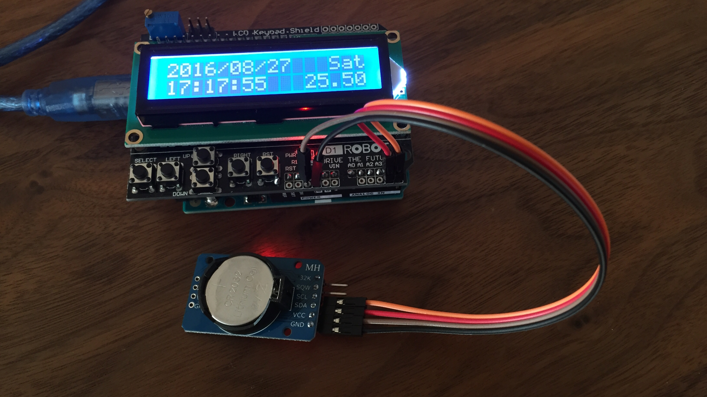

# smart-homekit-arduino 
My first Arduino project.

## Platform.IO
This is a [Platform.IO](http://platformio.org) project.

## Hardwares
* Arduino Uno
* DFRobot LCD Keypad Shield
* DS3231
* ESP8266 / NodeMCU

## Photos

